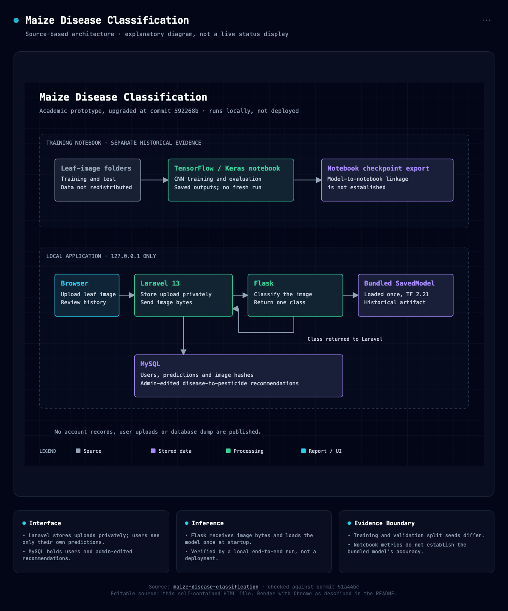

# Maize Disease Classification

A historical bachelor's capstone: a Laravel application sends maize leaf images to a Flask service backed by a TensorFlow convolutional neural network (CNN).

## Table of Contents

- [Background](#background)
- [Install](#install)
- [Usage](#usage)
- [Architecture](#architecture)
- [Data](#data)
- [Deploy and Teardown](#deploy-and-teardown)
- [Repository Layout](#repository-layout)
- [Limitations](#limitations)
- [Contributing](#contributing)
- [License](#license)

## Background

This repository was pulled from the original private project and cleaned up for public release: account records, the database dump, local files and the original Git history were left out. Documentation was added. The original project was completed in 2022; its notebook was added later, so the notebook's results do not establish where the bundled model came from.

As first published at commit `726494b`, the code, the notebook with its saved outputs and the model files were unchanged. The runtime upgrade in commits `df02f58` and `592268b` makes the application run locally on supported runtimes: the Flask service runs on Python 3.12 with TensorFlow 2.21 and the Laravel interface moved from Laravel 8 to Laravel 13 on PHP 8.5. The notebook, its saved outputs and the four model files are unchanged and nothing was retrained.

The original application declared TensorFlow 2.4.0, tensorflow-cpu 2.4.3, Keras 2.4.3 and Flask 1.1.2 for Python and PHP `^7.3|^8.0` with Laravel `^8.54`. The upgrade replaced those pins; the earlier versions remain in Git history.

## Install

Prerequisites on macOS: Homebrew, Python 3.12, a MySQL 8 or newer server and Node.js 24 or newer for the checks. The app was verified with PHP 8.5.11, Composer 2.10.3, Python 3.12.14, MySQL 9.3.0 and Node.js 26.9.0.

1. Install PHP and Composer:

   ```bash
   brew install php composer
   ```

2. Install the Flask service's hash-pinned dependencies (TensorFlow 2.21.0, Flask 3.1.3, Pillow 12.3.0 and NumPy 2.5.3):

   ```bash
   cd flask-app
   python3.12 -m venv .venv
   .venv/bin/python -m pip install --require-hashes -r requirements.txt
   cd ..
   ```

   [`flask-app/requirements.txt`](flask-app/requirements.txt) is resolved for macOS on Apple silicon. On another platform, install `tensorflow==2.21.0 flask==3.1.3 pillow numpy` and record the resolved versions.

3. Create a MySQL database and user for the app, replacing `<PASSWORD>` with a password of your choice:

   ```sql
   CREATE DATABASE maize_app CHARACTER SET utf8mb4 COLLATE utf8mb4_unicode_ci;
   CREATE USER 'maize_app'@'localhost' IDENTIFIED BY '<PASSWORD>';
   GRANT ALL PRIVILEGES ON maize_app.* TO 'maize_app'@'localhost';
   ```

4. Install the Laravel application and configure it. [`web-app/.env.example`](web-app/.env.example) lists every setting with placeholders, not credentials. Set `DB_USERNAME` and `DB_PASSWORD` in `web-app/.env`, which Git ignores:

   ```bash
   cd web-app
   composer install
   cp .env.example .env
   php artisan key:generate
   php artisan migrate --seed
   cd ..
   ```

   Migrations and the role seeder are safe to rerun.

Do not expose the application to a network. Both services listen on `127.0.0.1` only. See [Limitations](#limitations).

## Usage

Start the two services from the repository root, each in its own terminal:

```bash
flask-app/.venv/bin/python flask-app/server.py
```

```bash
cd web-app && php artisan serve --host=127.0.0.1 --port=8000
```

Open `http://127.0.0.1:8000`, register an account and make it an administrator:

```bash
cd web-app && php artisan app:make-admin <EMAIL>
```

Administrators add one recommendation per class under **Diseases**. Any signed-in user uploads a JPEG or PNG leaf image of up to 2 MB under **Predictions** and sees the predicted class with its recommendation. Users see only their own predictions. Uploading the same image again shows the earlier result instead of storing a duplicate. Stop each service with Ctrl+C.

The Flask endpoint can also be called directly with a multipart field named `image`:

```bash
curl -F image=@<LEAF_IMAGE> http://127.0.0.1:4040/disease-analyzer
```

It returns `{"prediction": "<class>"}` or an error with status 400, 413 or 500.

### End-to-End Check

With both services running and leaf images in `artifacts/fixtures/leaf_images/<class>/` with a `manifest.json`, run:

```bash
node scripts/app_e2e.mjs
```

It registers run-scoped users, checks access control, stores a placeholder recommendation per class, uploads every image through Laravel, compares each shown class with Flask's direct answer, repeats an upload to confirm no duplicate is stored and rejects a non-image. The report lands in `artifacts/e2e/app_run_<RUN_ID>/report.json` and `report.md`. Add `--synthetic` for a smoke run with generated images when no leaf images are available. Fixture images and reports stay local and are not committed.

### Local Checks

```bash
python3.12 -m venv .venv
.venv/bin/python -m pip install -r requirements_dev.txt
python3 scripts/install_markdownlint.py
.venv/bin/pre-commit install
.venv/bin/pre-commit run --all-files --hook-stage manual
```

[pre-commit](https://pre-commit.com) runs the hooks in [`.pre-commit-config.yaml`](.pre-commit-config.yaml) on every commit and commit message: commit messages, the archive, privacy, writing (including always time-bound words such as `currently`), document front matter (YAML with a `title` equal to the H1, a `description` and `last_updated`; READMEs are exempt), Markdown syntax with markdownlint-cli2 0.23.3 (settings in [`.markdownlint-cli2.jsonc`](.markdownlint-cli2.jsonc)), the bad and good samples of the document checks, Ruff on `scripts/` and the Flask service, strict MyPy on `scripts/` and secrets with gitleaks 8.30.1. `scripts/install_markdownlint.py` installs markdownlint-cli2 into `.tools/markdownlint-cli2` with `npm ci` from the committed lockfile in `scripts/markdownlint/`, which verifies each package's integrity hash and runs no install scripts; it needs Node.js 22 or newer. The secret check uses `GITLEAKS_BIN`, then `.tools/bin/gitleaks`, then `gitleaks` on your `PATH`. `PATH="$PWD/.venv/bin:$PATH" npm run ci` runs the same checks without pre-commit. The archive check, `npm run e2e`, writes `artifacts/e2e/archive_review/report.json`. It compares every application file with a source manifest that is kept outside the repository; without it, run `CI=true npm run e2e` to check the outgoing tree, the notebook and the four model-file hashes. GitHub Actions runs the same checks on pull requests and pushes to `main`.

The notebook can be opened in Jupyter to read its code and saved outputs without running it.

## Architecture



The editable source is [`docs/architecture/architecture.html`](docs/architecture/architecture.html). The diagram describes the checked-in implementation running locally, not a deployment. Model export is shown separately because the notebook and bundled checkpoint have no verified run-level link.

To render the self-contained diagram with an installed Chrome browser, run from the repository root:

```bash
"/Applications/Google Chrome.app/Contents/MacOS/Google Chrome" --headless=new --hide-scrollbars --window-size=1200,1440 --virtual-time-budget=5000 --screenshot=docs/architecture/architecture.png "file://$PWD/docs/architecture/architecture.html"
```

## Data

The notebook works with maize leaf images in four classes: Blight, Common Rust, Gray Leaf Spot and Healthy. Its saved output reports 3,560 files in the training folder and 628 in a separate test folder. The image dataset is not included and no dataset download is provided here.

The images come from the [Corn or Maize Leaf Disease Dataset](https://www.kaggle.com/datasets/smaranjitghose/corn-or-maize-leaf-disease-dataset) on Kaggle, compiled by Smaranjit Ghose. The original download, dated Jul 8 2021, matches that listing: 4,188 images, the same uncompressed size and the same count in each class. Its train and test folders hold the notebook's 3,560 and 628 images.

The dataset is classified as public data: it is openly published with the credits and terms below. The end-to-end check uses 8 images from that Kaggle download, 2 per class, as local fixtures. They are not redistributed here.

The retained notebook image shows only leaf samples and class labels. Account records, user uploads and database dumps are excluded. Images uploaded to a local run are stored in `web-app/storage/app/private/`, which Git ignores.

### Data Sources and Credits

The Kaggle listing states "Data files © Original Authors". Its compiler built the set from the PlantVillage and PlantDoc datasets, notes that the original authors keep their rights and asks users to credit them:

- **PlantDoc:** Singh D, Jain N, Jain P, Kayal P, Kumawat S and Batra N. "PlantDoc: A Dataset for Visual Plant Disease Detection." Proceedings of the 7th ACM IKDD CoDS and 25th COMAD, 2020, pp. 249–253. Images are licensed under [Creative Commons Attribution 4.0 International](https://creativecommons.org/licenses/by/4.0/) ([dataset repository](https://github.com/pratikkayal/PlantDoc-Dataset)).
- **PlantVillage (version cited by the Kaggle listing):** Arun Pandian J and Geetharamani Gopal. "Data for: Identification of Plant Leaf Diseases Using a 9-layer Deep Convolutional Neural Network." Mendeley Data, V1, 2019, [doi:10.17632/tywbtsjrjv.1](https://doi.org/10.17632/tywbtsjrjv.1). Released under [CC0 1.0](https://creativecommons.org/publicdomain/zero/1.0/).
- **Compilation:** Smaranjit Ghose, [Corn or Maize Leaf Disease Dataset](https://www.kaggle.com/datasets/smaranjitghose/corn-or-maize-leaf-disease-dataset), Kaggle, updated Nov 11 2020.

**Changes:** the notebook's embedded image shows sample leaves from these sources, resized and arranged in a grid with class labels. Which source each sample came from is not recorded, so both are credited. The MIT License covers only the original project code, not these images.

## Deploy and Teardown

There is no deployment workflow, live demo or provisioned infrastructure; the app runs only on a local machine. To tear down a local run, stop both services with Ctrl+C. To remove its data, drop the `maize_app` database and delete `web-app/storage/app/private/leaf_images/`.

## Repository Layout

| Path | Contents |
| --- | --- |
| `Maize_Diseases_Detection_Model.ipynb` | Original training code and saved outputs |
| `flask-app/` | Prediction service, its pinned dependencies and the four original TensorFlow model files |
| `web-app/` | Laravel 13 interface, migrations, policies, views and dependency lockfiles |
| `scripts/` | Archive, privacy, writing, front matter, Markdown, secret and commit-message checks, their samples and the app end-to-end runner |
| `.github/`, `.pre-commit-config.yaml` | GitHub Actions workflow and the pre-commit hooks that run the checks |
| `docs/architecture/` | Architecture diagram and its editable HTML source |

## Limitations

The notebook records test accuracy `0.8105095624923706` and test loss `2.938377618789673`. These are saved outputs, not a new measurement. Training and validation use seeds 344 and 564 on the same folder; overlap compromises validation and the selection of the best checkpoint. No retraining or corrected validation result is claimed.

The original Flask service accepted a server image path, reloaded the model for each request and started with debug enabled on all interfaces; the original Laravel interface saved images in a public directory and did not enforce its access policies. The runtime upgrade (`df02f58` and `592268b`) replaced those behaviors. The model was saved with TensorFlow 2.7.0 and runs on TensorFlow 2.21.0; whether its outputs match the original runtime exactly was not tested.

The end-to-end check passed with 8 Kaggle images on macOS with MySQL 9.3.0. In those runs 7 of 8 predictions matched the image's class folder; that is not an accuracy measurement and the images may overlap the original training data. Behavior when the Flask service is down, password reset email and the role screens were not exercised. Both services use development servers. Recommendation correctness, farm use, security review and production readiness have not been validated.

## Contributing

Individual project; contributions are not accepted.

## License

The original project code is licensed under the [MIT License](LICENSE). Existing third-party notices and license metadata remain intact. This license choice does not cover the dataset or the embedded leaf image; their sources and terms are in [Data Sources and Credits](#data-sources-and-credits).
